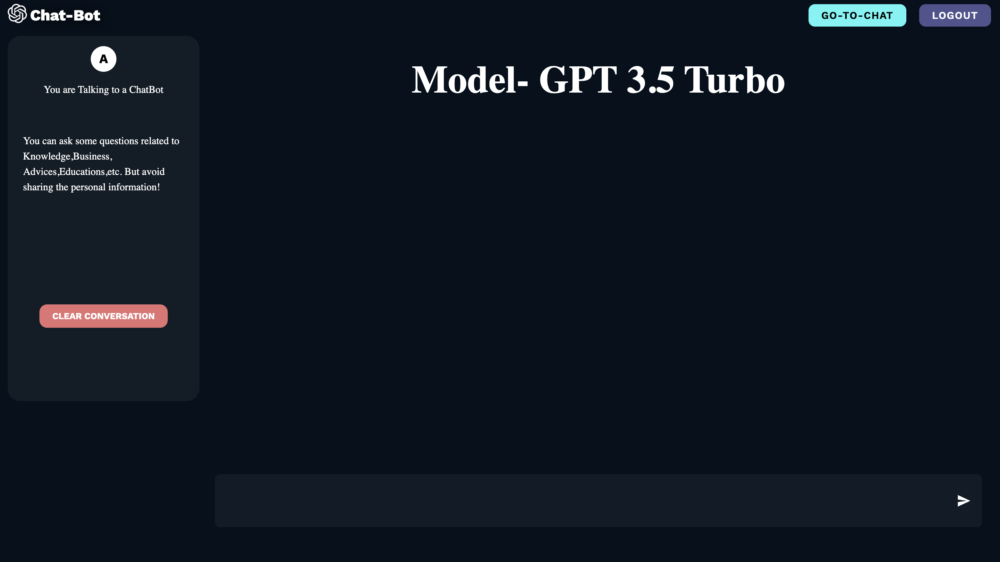
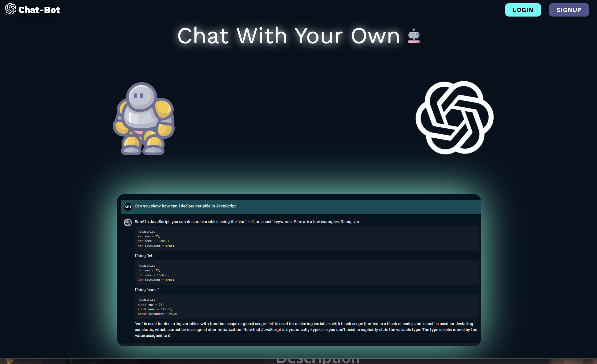
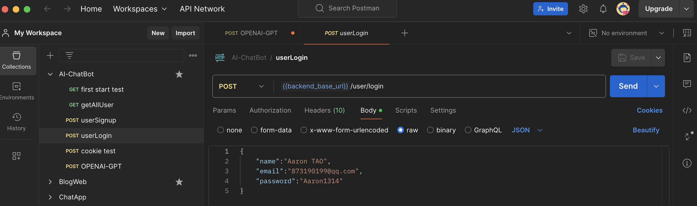

# ***The MockAI_Chat-Bot***

[Live Demo](https://mock-ai-chat-bot.vercel.app/)


## Table of Contents

- [Description](#description)
- [Version](#version)
- [Prerequisites](#prerequisites)
- [Quick Start](#quick-start)
- [Features](#features)
- [Core Functionality](#core-functionality)
- [Advanced Features](#advanced-features)
- [Project Architecture](#project-architecture)
- [Tech Stack](#tech-stack)
- [API Documentation](#api-documentation)
- [Demo](#demo)
- [Resources](#resources)
- [Roadmap](#roadmap)
- [Contact Information](#contact-information)
- [License](#license)

### Description

MockAI Chat-Bot is an intelligent chatbot application powered by OpenAI’s GPT-3.5 Turbo API. It provides users with a personalized chat experience, supporting user registration (signup), login, and logout. Whether you’re seeking quick answers, detailed explanations, or casual conversation, MockAI Chat-Bot is designed to help.

## Version

- **1.0:** Initial release with basic chat functionality and user authentication (signup & login).
- **1.1:** Enhanced chat experience, improved response speed and accuracy.
- **1.2:** UI and animation improvements for a more vivid display.
- **1.3:** More features coming soon...

## Prerequisites

- **Node.js**:  
  Install Node.js (v18.0.0 or above recommended). Download the latest version from the [official Node.js website](https://nodejs.org/).

- **Package Manager**:  
  Use either npm (comes with Node.js) or yarn. To install yarn globally, run `npm install -g yarn`. These are required for managing project dependencies.

- **OpenAI API Key**:  
  Obtain an API key from the [OpenAI platform](https://platform.openai.com/). Use the `dotenv` package to set it as an environment variable in your local development environment.

- **Database**:  
  A MongoDB database is required for backend data storage. Install the MongoDB Community Edition locally and ensure it is running. The backend uses `mongoose` to interact with MongoDB.

- **Backend Dependencies**:  
  In the project root, run `npm install` to install backend packages such as `axios` (HTTP requests), `bcrypt` (password hashing), and `express` (server framework), as specified in `package.json`.

- **Frontend Dependencies**:  
  In the frontend directory, run `npm install` to install frontend packages including `react`, `react-dom`, and UI libraries like `@mui/material`, ensuring compatibility as specified in `package.json`.


# **Quick_Start**：

### **Clone the Repository**

- Open your terminal and navigate to the directory where you want to store the project. Then run the following Git command:

  ```
  git clone https://github.com/HAONANTAO/Mock_AI_ChatBot.git
  cd Mock_AI_ChatBot
  ```


### Install Dependencies

- For both the front-end and back-end, run `npm i` in the root project directory. This will install all the packages listed in the `dependencies` and `devDependencies` sections of the `package.json` files for both parts of the application.
- The back-end uses packages like `axios`, `bcrypt`, and `express` for handling HTTP requests, user authentication, and server setup respectively. The front-end depends on libraries such as `react`, `@mui/material` for building the user interface.

```
npm install
```


### Running the Code

- Start the Backend first then running the Frontend.

  ```
  npm run dev
  ```

  
## Features

### 1. User Management

- **Signup:** Users register with name, email, and password. Passwords are securely hashed with `bcrypt` before storage. Upon registration, users receive a confirmation message with their account details.
- **Login:** Users log in with email and password. The system verifies credentials using `bcrypt` and, upon success, generates a JWT token stored as an HTTP-only cookie for secure session management.
- **Logout:** Users can log out at any time. The system clears the authentication cookie, ending the session securely.
- **Verification:** The app validates user identity by checking the JWT token against the database, ensuring only authorized users can access protected data.
- **User Retrieval:** Admins can retrieve the list of all users for management or analytics purposes.

### 2. Chat Functionality

- **Send Messages:** Users send messages through the chat interface. Each message is saved to the user's chat history in the database, including both user input and GPT responses.
- **GPT Responses:** The backend interacts with OpenAI's `gpt-3.5-turbo` model, sending chat history and receiving intelligent responses, which are saved and displayed to the user.
- **Chat History Management:** Users can view or delete their chat history. Deleting history removes all related records from the database, ensuring privacy.

---

## Core Functionality

### 1. User Authentication Workflow

- **Secure Signup:** User passwords are hashed with `bcrypt` before being stored, protecting against data breaches.
- **Reliable Login:** The system locates users by email and verifies passwords using `bcrypt`. On success, a JWT token is issued for authentication.
- **Cookie-Based Session:** JWT tokens are stored in HTTP-only cookies, providing secure session management and protecting against XSS attacks.
- **Logout & Cleanup:** Logging out clears the authentication cookie, ending the session and preventing unauthorized access.

### 2. Chatbot Integration

- **Personalized Chat History:** Each user's conversation is stored in the database, with roles (user or assistant) clearly marked for context.
- **Seamless GPT API Integration:** User messages and chat history are sent to OpenAI's API. Responses are parsed and added back to the user's chat history, enabling a natural, context-aware conversation.
- **Data Integrity:** When users delete their chat history, all related records are completely removed from the database to protect privacy and optimize storage.

## Advanced Features

More features are coming soon, including:
- Animations
- Image support
- ...and more!

---

## Project Architecture

### Backend

The backend is built on a Node.js server, designed for efficient asynchronous processing and scalability.

- **Layered Structure:**
  - **Middleware Layer:**  
    Uses Express.js as the core framework. Middlewares like `cors` handle cross-origin requests, `cookie-parser` manages cookies for sessions, `express-validator` validates incoming data, and `morgan` logs HTTP requests for debugging.
  - **Business Logic Layer:**  
    Written in TypeScript for type safety. Handles user signup/login/logout (with `bcrypt` for password hashing and `jsonwebtoken` for JWT-based authentication), and integrates with the OpenAI API (via `axios`) for chat functionality.
  - **Data Access Layer:**  
    Uses Mongoose for MongoDB object modeling. Stores user credentials and chat records in flexible collections. Sensitive data and API keys are managed securely using `dotenv`.

- **API Endpoints:**  
  RESTful endpoints are defined with Express.js, including `/signup`, `/login`, `/logout` for authentication, and `/sendChat`, `/getChats` for chat operations. All endpoints accept specific request formats and return JSON responses.

---

### Frontend

The frontend is built with React, following a component-based architecture.

- **Component Hierarchy:**
  - **Top-Level Components:**  
    Uses React Router DOM for navigation, mapping URLs to components like login and chat interfaces.
  - **Reusable UI Components:**  
    Integrates `@mui/material` for pre-built UI elements (buttons, forms, cards), and uses `@emotion/react` / `@emotion/styled` for scoped, dynamic CSS-in-JS styling.
  - **State-Managed Components:**  
    Utilizes Redux for global state management (user authentication, chat history), ensuring consistency across components.

- **Build & Tooling:**  
  Employs Vite for fast development and optimized builds. Eslint and TypeScript enforce code quality and type safety. Utility libraries like `React Icons` and `React Syntax Highlighter` enhance interactivity and presentation.

---

## Tech Stack

### Backend

- **Node.js**: Backend runtime environment with asynchronous, non-blocking I/O for handling concurrent requests efficiently.
- **Express.js**: Minimalist web framework for building RESTful APIs and managing middleware.
- **TypeScript**: Adds static typing for improved code quality, maintainability, and scalability.
- **MongoDB**: NoSQL database for flexible storage of user data and chat records.
- **Mongoose**: Object modeling tool for MongoDB, simplifying data model definition and CRUD operations.
- **bcrypt**: Secure password hashing for user authentication.
- **jsonwebtoken (JWT)**: Stateless authentication using tokens for secure session management.
- **axios**: Promise-based HTTP client for interacting with external APIs (e.g., OpenAI API).
- **dotenv**: Manages environment variables, keeping sensitive data (like API keys) secure.
- **cors**: Handles Cross-Origin Resource Sharing, allowing frontend-backend communication.
- **cookie-parser**: Parses and manages HTTP cookies for session handling.
- **express-validator**: Validates and sanitizes incoming request data.
- **morgan**: HTTP request logger for debugging and monitoring.
- **jest**: JavaScript testing framework for unit, integration, and end-to-end tests.

### Frontend

- **React**: Component-based UI library for building interactive user interfaces.
- **React Router DOM**: Enables single-page application routing and navigation.
- **Vite**: Fast development/build tool leveraging ES modules for optimal performance.
- **@emotion/react & @emotion/styled**: CSS-in-JS libraries for dynamic, component-scoped styling.
- **@mui/material**: Rich set of Material Design UI components for rapid interface development.
- **Redux & React Redux**: Centralized state management for user authentication and chat state.
- **React Icons**: Extensive icon library for enhancing UI visuals.
- **React Syntax Highlighter**: Displays formatted and highlighted code snippets in chat.
- **React Type Animation**: Adds animated typing effects for engaging UI interactions.
- **TypeScript**: Ensures type safety and code quality on the frontend.
- **eslint**: Linting tool to enforce consistent code style and catch errors early.

## API Documentation

### Introduction

This API documentation describes the endpoints for user management and chat functionality. All endpoints use JSON for data exchange and are prefixed with `/api/v1`.

---

### User Routes

#### `GET /user/`
- **Description:** Retrieve a list of all users (admin only).
- **Request:** No parameters.
- **Response:**
  - **200:** `{"message": "OK", "users": [user1, user2, ...]}`
  - **400:** `{"message": "error! not ok!", "cause": "error message"}`

---

#### `POST /user/signup`
- **Description:** Register a new user.
- **Request Body:**
  - `name` (string)
  - `email` (string)
  - `password` (string)
- **Response:**
  - **201:** `{"message": "user [name], [email] sign up successfully!", "name": "...", "email": "..."}`
  - **400:** `{"message": "error! signup not work!", "cause": "error message"}`

---

#### `POST /user/login`
- **Description:** Log in an existing user.
- **Request Body:**
  - `email` (string)
  - `password` (string)
- **Response:**
  - **200:** `{"message": "user [name], [email] log in successfully!", "name": "...", "email": "..."}`
  - **201:** `"user not registered, please check again"`
  - **200:** `{"message": "Incorrect password"}`
  - **404:** `{"message": "error! signup not work!", "cause": "error message"}`

---

#### `GET /user/auth-status`
- **Description:** Check authentication status (requires JWT token via HTTP-only cookie).
- **Response:**
  - **200:** `{"message": "OK", "name": "...", "email": "..."}`
  - **401:** `{"message": "Unauthorized", "cause": "error message"}`

---

#### `GET /user/logout`
- **Description:** Log out the current user (clears auth cookie).
- **Response:**
  - **200:** `{"message": "OK", "name": "...", "email": "..."}`
  - **401:** `{"message": "Unauthorized", "cause": "error message"}`

---

### Chat Routes

#### `POST /chat/new`
- **Description:** Send a new chat message and get a GPT response.
- **Request Body:**
  - `message` (string)
- **Response:**
  - **200:** `{"chats": [chat1, chat2, ...]}`
  - **500:** `{"message": "Something wrong while the GPT chat api"}`

---

#### `GET /chat/all-chats`
- **Description:** Get all chat history for the current user (requires JWT token).
- **Response:**
  - **200:** `{"message": "OK", "chats": [chat1, chat2, ...]}`
  - **401:** `{"message": "Unauthorized", "cause": "error message"}`

---

#### `DELETE /chat/delete`
- **Description:** Delete all chat history for the current user (requires JWT token).
- **Response:**
  - **200:** `{"message": "OK"}`
  - **401:** `{"message": "Unauthorized", "cause": "error message"}`

---

## Demo





## Resources

- [Core Chatbot Repository](https://github.com/Nikhilthadani/MERN-AI-ChatBot): Complete MERN+OpenAI chatbot code.
- [Core Video Tutorial](https://www.youtube.com/watch?v=wrHTcjSZQ1Y): In-depth video guide for building the core chatbot.
- [Simple Chatbot Repository](https://github.com/bradtraversy/chatgpt-chatbot): Source code for a simpler chatbot implementation.
- [Matched Video Tutorial](https://www.youtube.com/watch?v=1YU83Lw58eo&list=PLC20u92Q90A5DbsbyBoaWnj-6nzYMnyx8&index=16): Step-by-step video for the simple chatbot.
- [OpenAI Official Website](https://platform.openai.com/apps): Access official OpenAI services and documentation.
- [CloseAI (China)](https://platform.closeai-asia.com/developer/api/): Domestic OpenAI API access for China.
- [Video on Domestic API Access](https://www.youtube.com/watch?v=IzBGRH-6p7U&list=PLC20u92Q90A5DbsbyBoaWnj-6nzYMnyx8&index=17): How to use OpenAI API in China.
- [NextChat](https://app.nextchat.dev/#/): Test your OpenAI API Key usability in China.
- [Connecting Domestic and Overseas OpenAI](OPENAI.md): Detailed documentation for linking domestic and overseas OpenAI services.

---

## Roadmap

### Short-Term (1–2 Weeks)
- **UI Refinement:**  
  - Improve signup/login page design and mobile responsiveness.
  - Simplify forms, enhance error messages, and gather user feedback.
- **Error Handling:**  
  - Provide detailed error messages for users.
  - Expand backend error logging with more context (stack traces, user IDs, API call sequences).
- **Integration Improvements:**  
  - Explore additional GPT API parameters (e.g., temperature).
  - Implement caching for frequent questions to reduce API calls and improve speed.

### Medium-Term (3–4 Weeks)
- **New Features:**  
  - Enable social sharing of chat conversations.
  - Add analytics for chat sharing frequency.
  - Implement multi-language support and UI translation.
- **Performance Optimization:**  
  - Optimize MongoDB queries and add indexes.
  - Archive old chat history to maintain performance.

### Long-Term (Over 4 Weeks)
- **Advanced Functionality:**  
  - Support custom chatbot personas (e.g., tech expert, friendly guide).
  - Add user feedback/rating system for personas.
  - Integrate multi-factor authentication (SMS, biometrics).
  - Schedule regular security audits and penetration testing.
- **Scalability:**  
  - Migrate to cloud infrastructure (AWS, GCP, Azure).
  - Set up auto-scaling for traffic spikes.

## Contact Information

- **Name:** Aaron (HAONAN) TAO
- **Email:** [873190199@qq.com](mailto:873190199@qq.com)
- **GitHub:** [HAONANTAO](https://github.com/HAONANTAO)
- **LinkedIn:** [Aaron Tao](https://www.linkedin.com/in/haonan-tao-aaron)

---

## License

This project is licensed under the MIT License.


